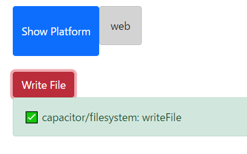
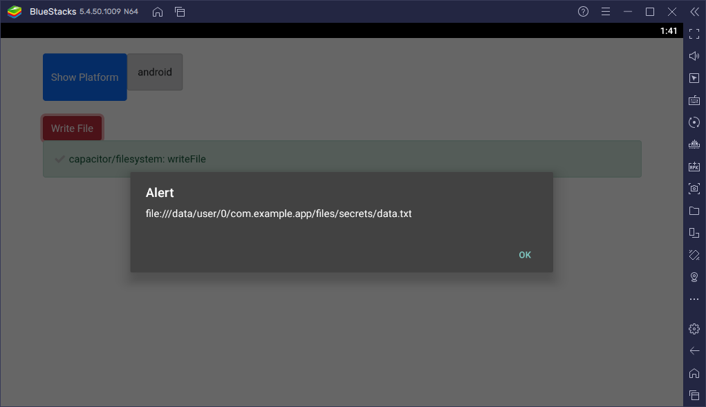

# Capacitor + Snowpack

## File IO by capacitor

### Setup
```bash
# install capacitor, snowpack
$ yarn add @capacitor/core @capacitor/filesystem
$ yarn add -D snowpack @capacitor/cli

$ npx cap init
$ npx cap sync

# install alpine.js
$ yarn add -D alpinejs
```

- `capacitor.config.json`

```json
{
  "server": {
    "url": "http://localhost:8080",
    "cleartext": true
  },
  "appId": "com.example.app",
  "appName": "App",
  "webDir": "www",
  "bundledWebRuntime": false
}
```

- `snowpack.config.mjs`

```javascript
/** @type {import("snowpack").SnowpackUserConfig } */
export default {
  root: './src',    // build 時のソースディレクトリ: ./src/
                    // 開発時は ./src/index.html がTOPページとなる
  mount: {
    /* ... */
  },
  plugins: [
    /* ... */
  ],
  routes: [
    /* Enable an SPA Fallback in development: */
    // {"match": "routes", "src": ".*", "dest": "/index.html"},
  ],
  optimize: {
    /* Example: Bundle your final build: */
    // "bundle": true,
  },
  packageOptions: {
    /* ... */
  },
  devOptions: {
    /* ... */
  },
  buildOptions: {
    out: './www'    // build 時の出力先: ./www/
                    // ※ capacitor の webDir を ./www/ にしているため
  },
};
```

- `src/index.html`

```html
<!DOCTYPE html>
<html>
<head>
  <meta charset="UTF-8">
  <meta http-equiv="X-UA-Compatible" content="IE=edge">
  <meta name="viewport" content="width=device-width, initial-scale=1.0">
  <title>Document</title>
  <link href="https://cdn.jsdelivr.net/npm/bootstrap@5.0.2/dist/css/bootstrap.min.css" rel="stylesheet" integrity="sha384-EVSTQN3/azprG1Anm3QDgpJLIm9Nao0Yz1ztcQTwFspd3yD65VohhpuuCOmLASjC" crossorigin="anonymous">
</head>
<body>
  <div class="container my-4" x-data="app()">
    <div class="d-flex">
      <button class="btn btn-primary" @click="showPlatform">Show Platform</button>
      <div x-html="platformMessage"></div>
    </div>
    <div class="mt-4">
      <button class="btn btn-danger" @click="writeFile">Write File</button>
      <div x-html="resultMessage"></div>
    </div>
  </div>
  <script type="module" src="/js/app.js"></script>
</body>
</html>
```

- `src/js/app.js`

```javascript
import { Capacitor } from '@capacitor/core';
import { Filesystem, Directory, Encoding } from '@capacitor/filesystem';
import Alpine from 'alpinejs';

window.app = () => {
  return {
    open: false,
    platformMessage: '',
    resultMessage: '',

    showPlatform() {
      this.platformMessage = `<div class="alert alert-dark">${Capacitor.getPlatform()}</div>`;
    },
    async writeFile() {
      try {
        alert(
          (await Filesystem.getUri({
            directory: Directory.Data,
            path: 'secrets/data.txt'
          })).uri
        );

        await Filesystem.writeFile({
          path: 'secrets/data.txt',
          data: '✅ capacitor/filesystem: writeFile',
          directory: Directory.Data,
          recursive: true,
          encoding: Encoding.UTF8
        });

        const content = await Filesystem.readFile({
          path: 'secrets/data.txt',
          directory: Directory.Data,
          recursive: true,
          encoding: Encoding.UTF8 
        });

        console.log(content);
        this.resultMessage = `<div class="alert alert-success">${content.data}</div>`;
      } catch (err) {
        this.resultMessage = `<div class="alert alert-danger">${err.toString()}</div>`;
      }
    }
  }
};

window.Alpine = Alpine;
Alpine.start();
```

### Execute snowpack development server
```bash
# launch snowpack development server
$ yarn snowpack dev

## => http://localhost:8080
```



### Deploy as android app
Android でファイル読み書きできるようにするためには権限を付与する必要がある

- `android/app/src/main/AndroidManifest.xml`

```diff
  <?xml version="1.0" encoding="utf-8"?>
  <manifest xmlns:android="http://schemas.android.com/apk/res/android"
      package="com.example.app">
  
      <application
          android:allowBackup="true"
          android:icon="@mipmap/ic_launcher"
          android:label="@string/app_name"
          android:roundIcon="@mipmap/ic_launcher_round"
          android:supportsRtl="true"
          android:theme="@style/AppTheme">
  
          <activity
              android:configChanges="orientation|keyboardHidden|keyboard|screenSize|locale|smallestScreenSize|screenLayout|uiMode"
              android:name="com.example.app.MainActivity"
              android:label="@string/title_activity_main"
              android:theme="@style/AppTheme.NoActionBarLaunch"
              android:launchMode="singleTask">
  
              <intent-filter>
                  <action android:name="android.intent.action.MAIN" />
                  <category android:name="android.intent.category.LAUNCHER" />
              </intent-filter>
  
          </activity>
  
          <provider
              android:name="androidx.core.content.FileProvider"
              android:authorities="${applicationId}.fileprovider"
              android:exported="false"
              android:grantUriPermissions="true">
              <meta-data
                  android:name="android.support.FILE_PROVIDER_PATHS"
                  android:resource="@xml/file_paths"></meta-data>
          </provider>
      </application>
  
      <!-- Permissions -->
  
      <uses-permission android:name="android.permission.INTERNET" />
+     <uses-permission android:name="android.permission.READ_EXTERNAL_STORAGE" />
+     <uses-permission android:name="android.permission.WRITE_EXTERNAL_STORAGE" />
  </manifest>
```

その後 BlueStacks (Androidエミュレータ) を起動し、以下のコマンドを実行

```bash
# add capacitor android platform
$ yarn add @capacitor/android
$ npx cap add android

# build snowpack files
$ yarn snowpack build

## => ./www/ にビルド済み web ファイル生成

# synchronize web files to capacitor android platform
$ npx cap sync android

## => ./www/ 内のファイルが capacitor android プロジェクトに同期される

# connect to android debug bridge port
## <port>: BlueStacks の起動ポートを指定
$ adb connect 127.0.0.1:<port> 

# deploy & execute capacitor app to android
$ npx cap run android
```


